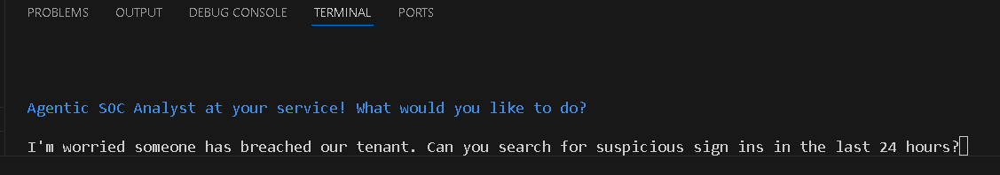
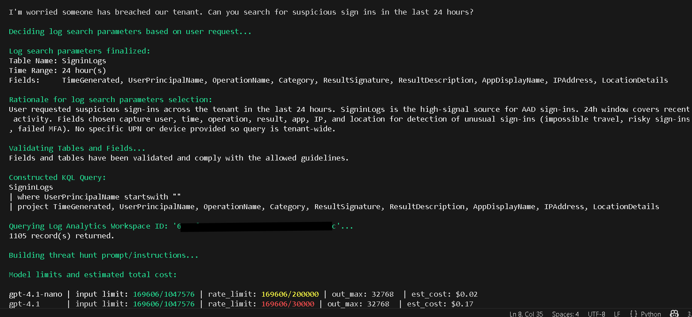
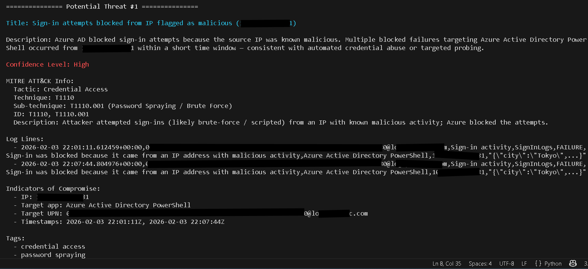

# Threat Hunting and Remediation Using Agentic AI  

  
  
  
  
  

---

## Overview

This project demonstrates the design and implementation of an **AI-assisted Security Operations Center (SOC) workflow** that supports threat hunting, investigation, and automated response using **Microsoft Sentinel**, **Microsoft Defender for Endpoint (MDE)**, and **OpenAI**.

The AI agent translates **natural language security concerns** into structured **KQL queries**, analyzes enterprise telemetry, and conditionally executes containment actions—while enforcing strict **cost controls** and **safety guardrails**.

The result is a **scalable, low-cost automation approach** that enhances analyst efficiency without sacrificing transparency or oversight.

---

## Key Capabilities

- Natural language–driven threat investigations  
- Dynamic KQL query generation  
- Sentinel log analysis and enrichment  
- Threat classification with confidence scoring  
- Automated endpoint containment via MDE  
- Full audit logging of findings and actions  
- **Average investigation cost: < $0.01 per run**

---

## Architecture Overview

**High-level workflow:**
1. SOC analyst submits a natural language investigation request
 
2. AI agent interprets intent and generates KQL
  
3. Azure Sentinel executes log queries
  
4. Results are analyzed and classified
  
5. Automated response actions are conditionally triggered

  
6. Findings and actions are logged for review  
 
---

## Environment Setup

### Prerequisites

- Windows host  
- Python  
- Visual Studio Code  
- Azure tenant with Microsoft Sentinel enabled  
- Permissions to query Log Analytics and execute MDE actions  

### Development Tools

- **Python** — core application logic  
- **Visual Studio Code** — development environment  
- **Black Formatter** — consistent code formatting  

---

## AI Agent Foundations

The AI agent is implemented in Python and structured to support modular expansion and controlled automation.

### Core Design Principles

- **Separation of concerns** (reasoning vs telemetry access)  
- **Modularity** (adaptable to different environments)  
- **Safety-first automation**  
- **Predictable operational cost**

OpenAI is used strictly for **reasoning and query generation**, while Azure services remain the **system of record**.

---

## Log Analytics Integration

The agent connects to Azure Log Analytics using:

- `azure-identity`  
- `azure-monitor-query`  
- `pandas`  

Authentication is handled via the **Azure CLI**, allowing the application to securely inherit tenant access.

Initial testing confirms:
- Successful Sentinel connectivity  
- Reliable KQL execution  
- Structured result retrieval  

---

## Improving Readability and Analyst Context

Raw query results are transformed into structured tables using **pandas**, improving clarity and reducing cognitive load.

This mirrors how SOC analysts expect findings to be presented:
- Clear fields  
- Actionable context  
- Human-readable formatting  

---

## Introducing AI Functionality

Once telemetry access is established, AI capabilities are enabled.

### Agent Responsibilities

- Parse investigation intent  
- Generate scoped KQL queries  
- Apply cost and safety checks  
- Analyze returned telemetry  
- Classify threats  
- Log findings  

The agent supports multiple models, allowing cost-effective selection.  
For this implementation, **GPT-5** is used.

---

## Cost Controls and Guardrails

Cost efficiency is treated as a **core design requirement**, not an afterthought.

### Guardrails Implemented

- Pre-execution cost estimation  
- Strict token limits (1,000 tokens)  
- Model selection controls  
- Scoped response actions  

**Observed results during testing:**
- Maximum investigation cost ≈ **$0.08**  
- Typical investigation cost: **well under $0.01**  
- Total API usage during development: **~$0.20**

These results validate the agent’s suitability for **continuous SOC usage** rather than isolated experimentation.

---

## Agent Behavior and Threat Identification

The agent operates under a defined **SOC Analyst role**, established via system-level instructions.

### Example Investigation Prompt

> *“I’m worried someone has breached our tenant. Can you search for suspicious sign-ins in the last 24 hours?”*

From this prompt, the agent:
- Extracts intent  
- Generates appropriate KQL  
- Queries Sentinel  
- Analyzes authentication activity  
- Identifies suspicious patterns  

Each identified event is enriched with:
- Attack category or technique  
- Relevant investigative or response guidance  
- Confidence level  

Findings are logged to structured **JSON output** for review.

---

## Automated Threat Response

The final phase introduces **automated containment** using Microsoft Defender for Endpoint.

When malicious activity meets predefined thresholds, the agent can:
- Generate follow-up KQL queries  
- Correlate users, sessions, and endpoints  
- Isolate affected virtual machines via MDE  

This mirrors real-world SOC escalation workflows, where containment is prioritized to limit impact while preserving evidence.

---

## Action Validation and Auditability

All response actions are validated through **MDE status checks**.

A *pending completion* status confirms that containment actions were successfully submitted.

Every investigation and response is logged, including:
- Triggering indicators  
- Investigation context  
- Actions taken  
- Outcomes  

This ensures all automated decisions remain **traceable, auditable, and analyst-reviewed**.

---

## Why This Matters

This project demonstrates how AI can be responsibly integrated into SOC workflows—not as a replacement for analysts, but as a **force multiplier**.

### Outcomes

- Faster investigations  
- Reduced manual effort  
- Predictable, minimal cost
 
- Controlled and auditable automation  

From initial detection to automated containment, this agent showcases a **practical, production-minded approach** to modern threat hunting and remediation.

---

## Future Improvements

Potential enhancements include:
- Human approval gates for high-impact actions  
- Expanded MITRE ATT&CK mapping  
- Alert deduplication and suppression  
- Scheduled proactive threat hunts  
- Multi-workspace and multi-tenant support  

---
